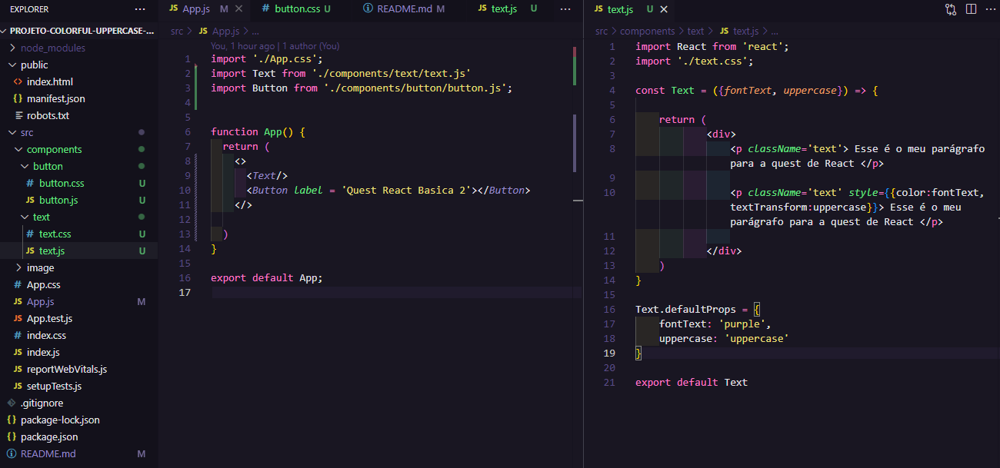
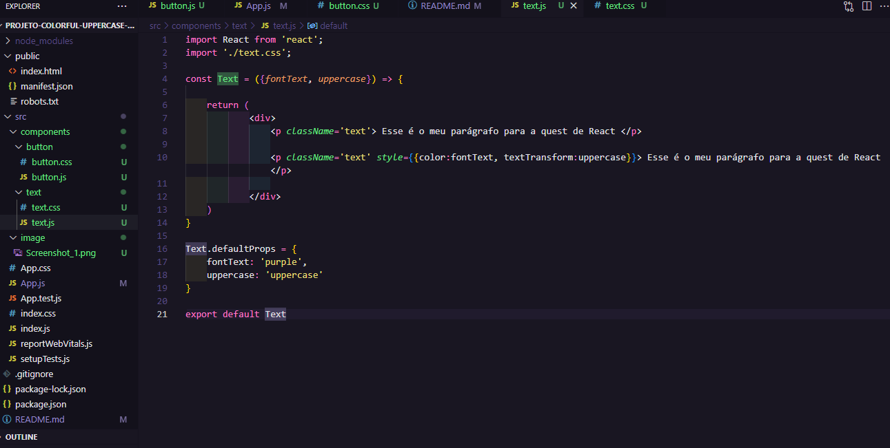
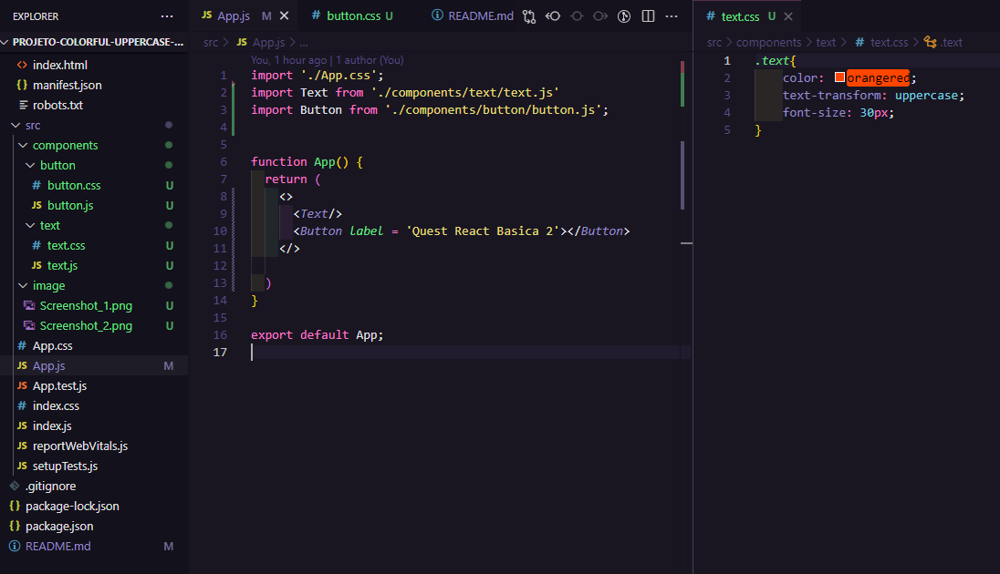
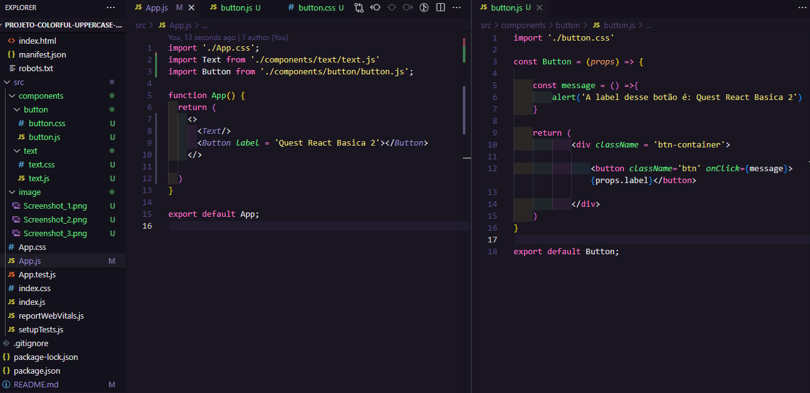
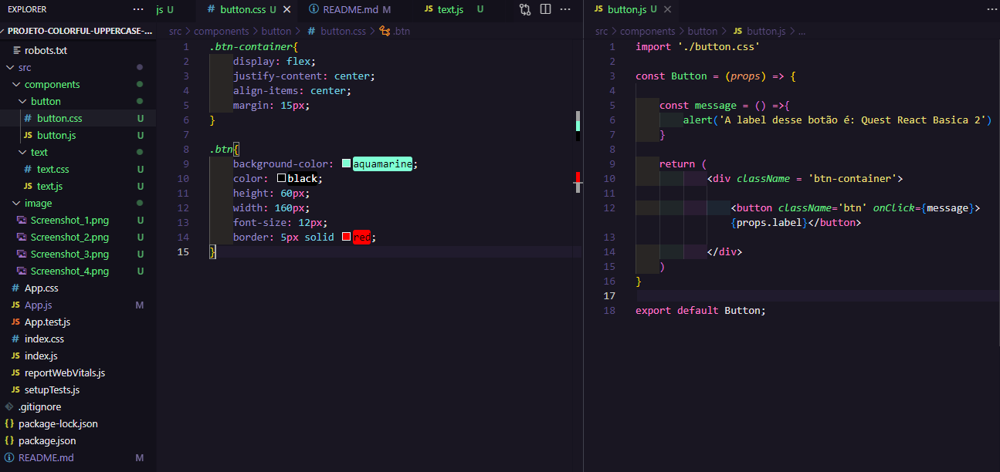

📌Criei o projeto com nome de **Projeto colorful uppercase paragraph**. 

🔴 **O projeto deve executar as seguintes Desafios:**

 ✔️O Componente deverá **colorir** e transformar para **maiúsculo (uppercase)** utilizando JS, em um parágrafo do texto.

✔️ Mostrar mensagem com a label do botão

✳️Através do console do **Git Bash Here**, rodei o comando **npx create-react-app**, para baixar a biblioteca do **React**.

**Primeiro criei o componente text para executar o Desafio 1 - *Componente que colore e transforma um texto para maiúsculo (uppercase) utilizando JS.***

➡️Foram criadas as pastas ***componente*** e nela a pasta ***text*** com o arquivo **text.js**, sendo ele um **componente de classe Text,** onde será trabalhado o texto. 

O arquivo **App.js** faz parte da biblioteca do React, foi apenas modificado para componente ***text.js***.

No arquivo text.js, fiz algumas alterações, ao invés de usar o componente de classe alterei para o componente de função, onde foram criadas props para colorir o parágrafo com a  cor “vermelha” e deixa-lo com as letras “maiúsculas”.

Arquivos que foram trabalhados… Apps.js (é através dele que será renderizado no navegador o texto) e text.css (criado para estilizar o texto)

**Segundo criei o componente button para executar o Desafio 2 - *Mostrar mensagem com a label do botão…***

➡️ Foram criadas as pastas componentes e nela a pasta button com os arquivos button.js e button.css.

No arquivo **button.js** foi criada um componente de função Button, para criar um botão onde terá um evento que ao clicar no botão apareça uma mensagem de alerta.

O arquivo Apps.js, como já faz parte da biblioteca do React, foi modificado para que possa renderizado navegador o **Texto** e o **Botão** criados.

O arquivo button.css, foi criado para estilizar o botão.

### Autor

- Execução do projeto - [Igor Batista](https://github.com/igor-batista-pereira)